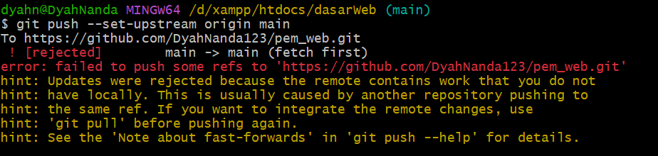
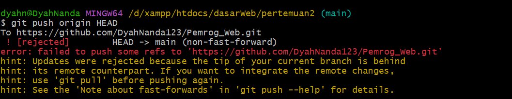

Maaf pak, saya baru mengirim di github. Karena sempat terdapat kendala pada branch nya dan juga pada repository yang tidak terbaca oleh cmd maupun gitbash.

Sejak pertemuan 1 (2-3 minggu lalu) sudah saya coba untuk git melalui gitbash tapi selalu terkendala pak,
sehingga saya drag terlebih dahulu. Untuk file pertemuan 1 terdapat 2 yang satu kosong karena memang sempat eror, saat saya coba menghapus folder yang kosong justru menambah eror pak, maka saya biarkan. 

Untuk contoh eror nya seperti berikut:

Mohon maaf pak, untuk pertemuan 4 saya (PHP) telat mengirim di git maupun di LMS. Karena git saya terkendala pak, masih dibagian branch nya. Dan LMS baru bisa di akses.. Terimakasih pak
